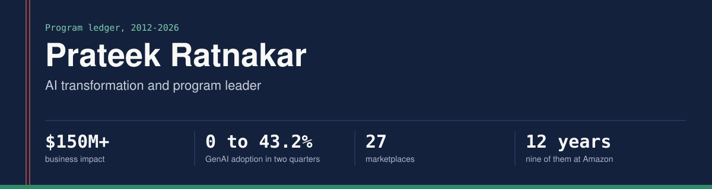

I build programs that do not exist yet, and the systems that keep them honest. Over 12 years, nine of them at Amazon, I have founded a GenAI and agentic AI program from a blank charter, reversed a $22.5M cost mandate into a $30M savings roadmap, and converged two global organizations onto one operating model across 27 marketplaces.

**[Portfolio](https://prateek-ratnakar.github.io)** | [LinkedIn](https://www.linkedin.com/in/prateekratnakar) | prateek.ratnakar@gmail.com | Bengaluru, India, open to relocation and remote

## The ledger

| Repository | What it shows | Headline figure |
|---|---|---|
| [Enterprise-GenAI-Adoption-Framework](https://github.com/prateek-ratnakar/Enterprise-GenAI-Adoption-Framework) | How I founded a GenAI program from a blank charter and made adoption the metric | Adoption 0 to 43.2% in two quarters; 14 systems in production, with 12 more in a second wave |
| [personal-agentic-ai-toolkit](https://github.com/prateek-ratnakar/personal-agentic-ai-toolkit) | Personal Claude agents I designed: job-fit scoring with a grounding check and a human gate | Every number in a draft must trace to a verified source |
| [intelligent-routing-framework](https://github.com/prateek-ratnakar/intelligent-routing-framework) | The architecture and launch playbook behind Intelligent Priority Routing | 10M+ contacts a year; executive escalations down 90% |
| [ops-cost-transformation-toolkit](https://github.com/prateek-ratnakar/ops-cost-transformation-toolkit) | The method behind a single-cycle cost transformation, and a cut mandate I reversed | $99.4M in annualized savings; $22.5M cut reversed into a $30M roadmap |
| [ops-market-launch-playbook](https://github.com/prateek-ratnakar/ops-market-launch-playbook) | The four-pillar playbook for launching operations in a new country | A zero-defect Ireland launch and a move from two country launches a year to five |
| [agentic-enterprise-workflows](https://github.com/prateek-ratnakar/agentic-enterprise-workflows) | A working prototype: one policy-agnostic agent engine that runs three industry workflows as configuration, on synthetic data | No automatic decision without a retrieved policy clause; 10 design rules enforced as tests |
| [workflow-value-architecture-kit](https://github.com/prateek-ratnakar/workflow-value-architecture-kit) | The working set that takes a process from how it runs to an AI-ready design with a value case | 8 artifacts across 4 process families, with an AI-readiness scorer |

## How I work

I work at the architecture, requirements and evaluation layer. I design systems at diagram level, write the requirements, the prompts and the acceptance criteria, and write SQL for my own analysis. Implementation belongs to engineering, and I do not write or review application code. Where a repository here contains code, I designed it and Claude, an AI assistant, wrote it to my specification.

## Recognition

Amazon North Star Award (2025 and 2021) | Business Leader of the Year (2019) | IIT (BHU) Varanasi | IIM Bangalore

*Every figure here matches my resume, my portfolio and my interview answers.*
